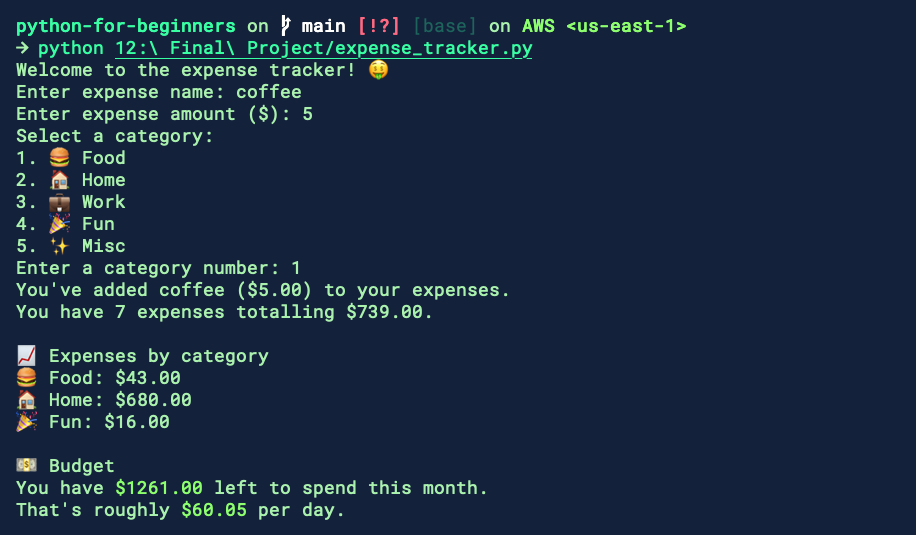

# Final Project: Personal Expense Tracking App

The goal of this project is create a Python app that lets you (as a user) track and categorize your monthly expenses and help you budget.

The app will let users type their expense category and amount directly into the terminal. It'll then save (append) that expense entry to a file. And finally, read the file to summarise the expense totals for that month.

It'll also tell the user how much they can spend for the rest of the month to stay in budget (which is a custom value decided by your app, e.g. `$2000`.

## 🎯 App Requirements

1. Ask the user to add an expense (name, category, amount)
2. Save expense entries to a `.csv` file.
3. Read the file to summarise the expense totals for that month
4. Show the user how much they can spend for the rest of the month (to stay in budget)

### ✨ Bonus

1. Show expenses by category
2. Give the user a rough estimate of how much they have left to spend per day

## 💡 Recommended Project Structure

The final project will consist of 2 files:

1. `expense.py`: A class for creating and storing expense objects.
2. `expense_tracker.py`: The main application logic.

## ✅ Tasks

1. Create the `expense.py` class.
2. Create the `expense_tracker.py` file and write the main logic for the app.
3. Run the app to test it.

## Example Screenshot

You should also be able to import your generated CSV to apps like Excel and Google Drive.

